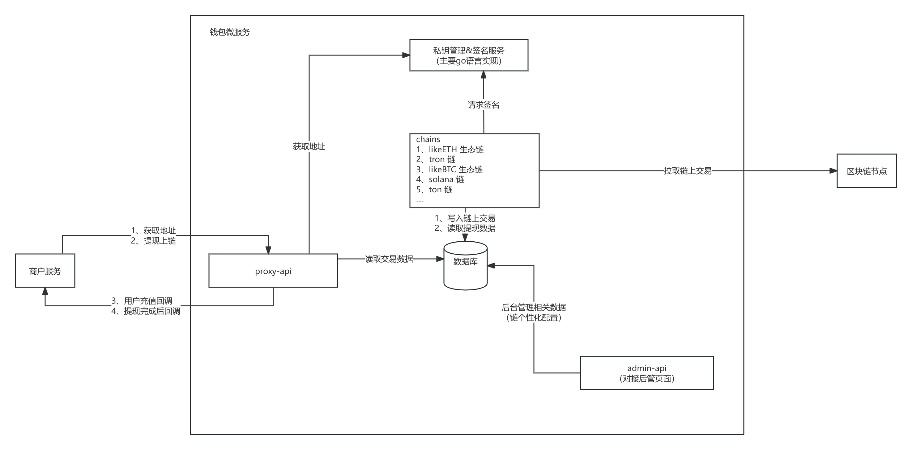

# 项目说明
## 项目简介
## 运行环境
### 架构和流程图

### 1、admin-api 后台管理接口
提供后台管理接口：
#### 商户管理：商户开通，填写商户公钥，查询平台公钥
#### 商户链和币种管理，配置链对应的冷钱包地址，设置转冷阈值，归集策略配置
#### 商户提现管理
#### 商户充值管理
### 2、chains 接链服务
#### 2.1 likeBTC
#### 2.2 likeETH 支持接入所有的evm链包括但是不限于arbitrum，optimism，polygon，zksync，zkevm，base等
#### 2.3 tron 接入trc20和trx
### 3、proxy-api 钱包api接口服务
该服务对接商户接口，提供获取地址接口、提币请求、读取交易记录接口、充值回调、提现完成后回调