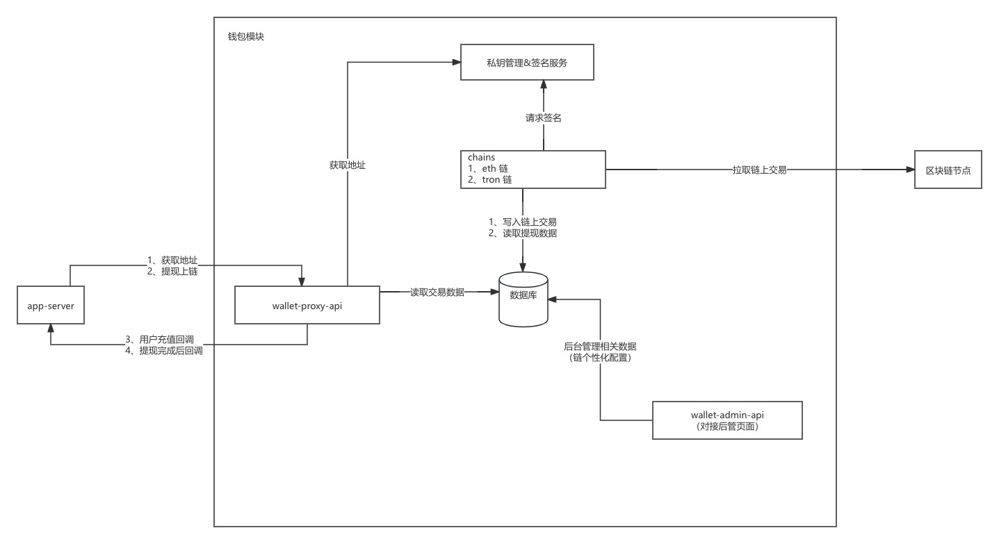

## 交互流程

### 需要实现的接口
1、获取地址 POST /api/v1/address/create
~~~
{
  "pid": 1382528827416576,
  "chain_id": "60",
  "timestamp": 1688004243314,
  "sign": "d6eef2de79e39f434a38efb910213ba6"
}
返回
{
  "code": "00000",
  "msg": "ok",
  "data": {
    "address": "TBotPUNNgeSJmqWkSE7JoHdAnsdMyVnUca"
  }
}
~~~
2、查询项目支持的币种信息 POST /api/v1/coins
~~~
{
   "pid": 1382528827416576,
  "timestamp": 1688004243314,
  "sign": "d6eef2de79e39f434a38efb910213ba6"
}
返回
{
    "code": "00000",
    "msg": "ok",
    "data": {
        "address_coins": [
            {
                "coin_name": "TRON#Shasta",
                "chain_id": "195",
                "token_id": "195"
            },
            {
                "coin_name": "Dogecoin",
                "chain_id": "3",
                "token_id": "3"
            }
        ]
    }
}
~~~
3、发起提币申请 POST /api/v1/payout
~~~
{
  "pid": 1382528827416576,
  "currency": "195@195",
  "address": "TXsmKpEuW7qWnXzJLGP9eDLvWPR2GRn1FS",
  "amount": "1.1",
  "remark": "payout",
  "nonce": "hwlkk6 唯一id",
  "timestamp": 1688004243314,
  "sign": "d6eef2de79e39f434a38efb910213ba6"
}
返回
{
  "code": "0",
  "msg": "ok",
  "data": {
    "cid": 1382688606330880
  }
}
~~~
4、地址充值通知 注册商户时填写回调地址
~~~
{
    "pid": 1382528827416576,
    "cid": 1391751691788288,
    "chain_id":"195",
    "token_id":"195",
    "currency": "TRX",
    "amount": "1.2",
    "address":"TXsmKpEuW7qWnXzJLGP9eDLvWPR2GRn1FS",
    "status": 1,
    "txid": "6dd05b0972075542219a3fcc116c58feaf9480f1f698cc46c4367ded83955cfd",
    "block_height": "34527604",
    "block_time": 1686814482000,
    "nonce": "ubqso3",
    "timestamp": 1687850657960,
    "sign": "f5be13fdd8c6f63951ca4427359457cb"
}
~~~